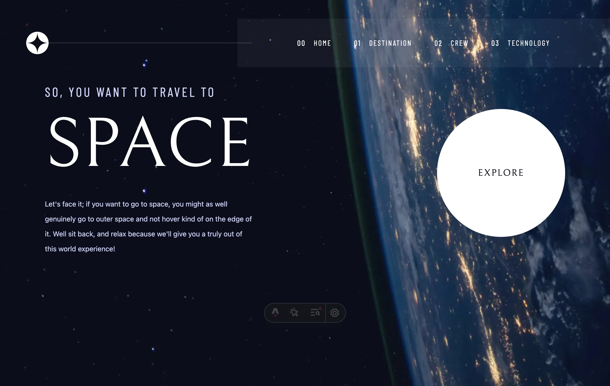

# Frontend Mentor - Space tourism website solution

This is a solution to the [Space tourism website challenge on Frontend Mentor](https://www.frontendmentor.io/challenges/space-tourism-multipage-website-gRWj1URZ3). Frontend Mentor challenges help you improve your coding skills by building realistic projects.

## Table of contents

- [Overview](#overview)
  - [The challenge](#the-challenge)
  - [Screenshot](#screenshot)
  - [Links](#links)
- [My process](#my-process)
  - [Built with](#built-with)
  - [What I learned](#what-i-learned)
  - [Continued development](#continued-development)
  - [Useful resources](#useful-resources)
- [Author](#author)
- [Acknowledgments](#acknowledgments)

**Note: Delete this note and update the table of contents based on what sections you keep.**

## Overview

### The challenge

Users should be able to:

- View the optimal layout for each of the website's pages depending on their device's screen size
- See hover states for all interactive elements on the page
- View each page and be able to toggle between the tabs to see new information

### Screenshot



Add a screenshot of your solution. The easiest way to do this is to use Firefox to view your project, right-click the page and select "Take a Screenshot". You can choose either a full-height screenshot or a cropped one based on how long the page is. If it's very long, it might be best to crop it.

Alternatively, you can use a tool like [FireShot](https://getfireshot.com/) to take the screenshot. FireShot has a free option, so you don't need to purchase it.

Then crop/optimize/edit your image however you like, add it to your project, and update the file path in the image above.

**Note: Delete this note and the paragraphs above when you add your screenshot. If you prefer not to add a screenshot, feel free to remove this entire section.**

### Links

- Solution URL: [Add solution URL here](https://your-solution-url.com)
- Live Site URL: [Add live site URL here](https://your-live-site-url.com)

## My process

### Built with

- Semantic HTML5 markup
- CSS custom properties
- Flexbox
- CSS Grid
- Mobile-first workflow
- [Astro](https://astro.build/) - Web framework
- [Tailwind CSS](https://tailwindcss.com/) - CSS framework
- Astro View Transitions - Smooth page transitions

### What I learned

#### Astro View Transitions API

> tips: you can also find out react version [here](https://reactrouter.com/how-to/view-transitions) as well.

I learned how to implement smooth page transitions using Astro's View Transitions API. This allows for seamless background image switching between pages without any jarring white flashes.

Here's how I implemented custom fade animations:

```javascript
import { ClientRouter, fade, slide } from "astro:transitions";

// Custom fade animation with 700ms duration
const customFade = fade({ duration: 700 });
```

#### Persistent Elements During Page Transitions

I learned how to keep the Navbar persistent across page transitions using the `transition:persist` attribute:

```astro
<nav
  transition:persist
  transition:animate="fade"
>
  <!-- Navbar content -->
</nav>
```

This ensures the navigation bar stays visible during page transitions, creating a smoother user experience.

#### Background Image Transitions

I implemented smooth background image transitions by:

1. Using `transition:name` to identify elements that should transition
2. Applying custom fade animations to background images
3. Setting a black background to prevent white flashes during image loading

```astro
<div
  class="background-container"
  transition:name="background"
  transition:animate={customFade}
>
  <Image src={backgroundDesktop} transition:name="background-desktop" />
</div>
```

#### Responsive Image Loading with Astro Image

I learned how to use Astro's optimized Image component with different sources for mobile, tablet, and desktop:

```astro
{backgroundMobile && (
  <Image
    src={backgroundMobile}
    class="block md:hidden"
    transition:name="background-mobile"
    transition:animate={customFade}
  />
)}
```

This ensures users get appropriately sized images for their devices while maintaining the smooth transition effect.

### Continued development

Areas for future improvement:

- **Advanced View Transitions**: Explore more complex transition effects like slide animations for different directions (forward/back navigation)
- **Performance Optimization**: Further optimize image loading and implement lazy loading for non-critical images
- **Accessibility**: Enhance keyboard navigation and screen reader support for the mobile menu and transitions
- **Animation Timing**: Fine-tune transition durations based on user feedback to find the optimal balance between smoothness and speed

### Useful resources

- [Astro View Transitions Documentation](https://docs.astro.build/zh-tw/reference/modules/astro-transitions/) - Comprehensive guide on implementing smooth page transitions in Astro. This helped me understand the `transition:persist`, `transition:name`, and `transition:animate` attributes.
- [Astro Image Optimization](https://docs.astro.build/zh-tw/guides/images/) - Official documentation on Astro's Image component for optimized image loading.
- [Tailwind CSS Documentation](https://tailwindcss.com/docs) - Essential reference for utility-first CSS styling.

These resources were crucial in implementing the smooth page transitions and responsive image loading throughout the project.

## Author

- Website - [Add your name here](https://www.your-site.com)
- Frontend Mentor - [@yourusername](https://www.frontendmentor.io/profile/yourusername)
- Twitter - [@yourusername](https://www.twitter.com/yourusername)

**Note: Delete this note and add/remove/edit lines above based on what links you'd like to share.**

## Acknowledgments

This is where you can give a hat tip to anyone who helped you out on this project. Perhaps you worked in a team or got some inspiration from someone else's solution. This is the perfect place to give them some credit.

**Note: Delete this note and edit this section's content as necessary. If you completed this challenge by yourself, feel free to delete this section entirely.**
