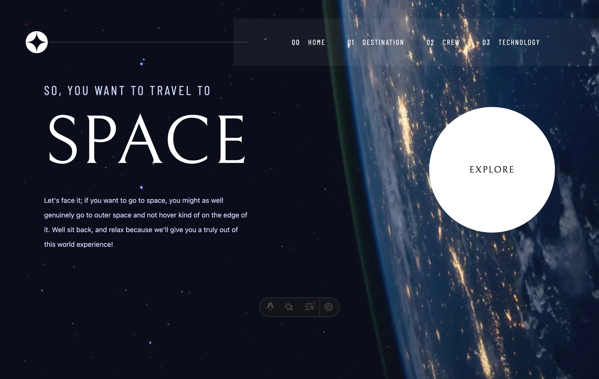

# Frontend Mentor - Space tourism website solution

This is a solution to the [Space tourism website challenge on Frontend Mentor](https://www.frontendmentor.io/challenges/space-tourism-multipage-website-gRWj1URZ3). Frontend Mentor challenges help you improve your coding skills by building realistic projects.

## Table of contents

- [Overview](#overview)
  - [The challenge](#the-challenge)
  - [Screenshot](#screenshot)
  - [Links](#links)
- [Getting Started](#getting-started)
  - [Commands](#commands)
- [My process](#my-process)
  - [Built with](#built-with)
  - [What I learned](#what-i-learned)
  - [Continued development](#continued-development)
  - [Useful resources](#useful-resources)
- [Deployment](#deployment)
  - [GitHub Pages](#github-pages)
- [Author](#author)
- [Acknowledgments](#acknowledgments)

## Overview

### The challenge

Users should be able to:

- View the optimal layout for each of the website's pages depending on their device's screen size
- See hover states for all interactive elements on the page
- View each page and be able to toggle between the tabs to see new information

### Screenshot



### Links

- Solution URL: [https://github.com/Chious/fm-space-tourism-muiti-page](https://github.com/Chious/fm-space-tourism-muiti-page)
- Live Site URL: [https://chious.github.io/fm-space-tourism-muiti-page/](https://chious.github.io/fm-space-tourism-muiti-page/)

## Getting Started

### Environment Variables

```shell
cp .env.example .env
```

you should defined `BASE_PATH` and `SITE_URL` in repo secret for automatic deployment to GitHub Pages.

```plaintext
BASE_PATH=your-repo-name
SITE_URL=https://your-account-name.github.io
```

### Commands

All commands are run from the root of the project, from a terminal:

| Command                   | Action                                                   |
| :------------------------ | :------------------------------------------------------- |
| `npm install`             | Installs dependencies                                    |
| `npm run dev`             | Starts local dev server at `localhost:4321/${BASE_PATH}` |
| `npm run build`           | Build your production site to `./dist/`                  |
| `npm run preview`         | Preview your build locally, before deploying             |
| `npm run astro ...`       | Run CLI commands like `astro add`, `astro check`         |
| `npm run astro -- --help` | Get help using the Astro CLI                             |

## My process

### Built with

- Semantic HTML5 markup
- CSS custom properties
- Flexbox
- CSS Grid
- Mobile-first workflow
- [Astro](https://astro.build/) - Web framework
- [React](https://react.dev/) - Still mainly in Astro, but for interactive UI (like `tabs` to switch between different content in this project) we can use `React` in `Astro` by using `@astrojs/react` integration.
- [Tailwind CSS](https://tailwindcss.com/) - CSS framework
- [Nanostores](https://github.com/nanostores/nanostores) - State management
- [Shadcn UI](https://ui.shadcn.com) - Accessible UI components
- Astro View Transitions - Smooth page transitions
- class-variance-authority, clsx, tailwind-merge - Styling utilities

### What I learned

It has been two years frist buit up this project in student days [Chious/front-mentor-space-tour](https://github.com/Chious/front-mentor-space-tour), yeah code smell is all over the place, but I find out it takes time to improve code style and architecture, in the era of VIBE CODING (Everying may fast, but wrong). Sincerly, be patient to build up a product instead of hurry to finish it.

And in this project, trying to practice Astro's Features and styling after built with fullstack or app stuff in the work.


### UI Library for Astro

> Sometimes, I just need simple ui for setup `aria-label` or `aria-describedby` or don't want to write `navbar` or `tabs` repeatedly. So, I use `Shadcn UI`.

It's rely on `React` to render the ui, still not find out suitable ui library for `Astro` yet, but it works, trying for `Daisy UI`, but its documentation is not maintain well and not easy to use.

Documentation: [React UI with shadcn/ui + Radix + Tailwind](https://vercel.com/academy/shadcn-ui?fbclid=IwY2xjawNf9ytleHRuA2FlbQIxMQABHiQjYKPW_-IFhdapYMklya-goLye5C3tEmLEh_VvtKTHAkkAasZEhEmeG5xj_aem_hrqERYSIp8gDHupaR62jxw) -- this document tells reason why recently more and more developers use `Shadcn UI` instead of `Material UI`, and how to setup design /UI system for your project.

```jsx
import { Button } from "@/components/ui/button";

<Button aria-label="Click me">Click me</Button>;
```

#### Astro View Transitions API

DOCUMENTATION: [Astro View Transitions Documentation](https://docs.astro.build/zh-tw/reference/modules/astro-transitions/)

> tips: you can also find out react version [here](https://reactrouter.com/how-to/view-transitions) as well.

I learned how to implement smooth page transitions using Astro's View Transitions API. This allows for seamless background image switching between pages without any jarring white flashes.

Here's how I implemented custom fade animations:

```javascript
import { ClientRouter, fade, slide } from "astro:transitions";

// Custom fade animation with 700ms duration
const customFade = fade({ duration: 700 });
```

#### State Management with Nanostores in Astro

> As mentioned in the [Share state between islands](https://docs.astro.build/zh-tw/recipes/sharing-state-islands/), Astro recommends using Nanostores for state management between islands(or more specific, components).

But honestly, when comes to design ui.it's wired to think in `React` way, instead of server side rendering default by `Astro`, while designing client-side interative UI (like `tabs` to switch between different content in this project) but you already have the data in server side (in this project, the data is in the `data.json` file).

```jsx
import { Tabs, TabsList, TabsTrigger, TabsContent } from "@/components/ui/tabs";

// atom here to control image or data to display while click tabs
export const selectedDestination = atom("moon");

return (
  <Tabs>
    <TabsList>
      <TabsTrigger value="destination">Destination</TabsTrigger>
      <TabsTrigger value="crew">Crew</TabsTrigger>
      <TabsTrigger value="technology">Technology</TabsTrigger>
    </TabsList>
<Tabs>
  <TabsList>
    <TabsTrigger value="destination">Destination</TabsTrigger>
    <TabsTrigger value="crew">Crew</TabsTrigger>
    <TabsTrigger value="technology">Technology</TabsTrigger>
  </TabsList>
  <TabsContent value="destination">Destination content</TabsContent>
  <TabsContent value="crew">Crew content</TabsContent>
  <TabsContent value="technology">Technology content</TabsContent>
</Tabs>
)
```

#### Responsive Image Loading with Astro Image

By default, Astro's Image component is optimized for responsive images, you can use the `format` prop to specify the image format (webp, png, etc.) and the `width` prop to specify the image width.

**Server Side Rendering**

```jsx
import { Image } from "astro:assets";

<Image src={image} format="webp" width={100} height={100} />;
```

**Client Side Rendering**

Also, `<Image />` only support for Server Component, so I use `vite-imagetools` plugin for vite to optimize the image loading for client-side. (`Astro` buit in `vite` for module bundling, through it's not mentioned in `package.json`.)

`astro.config.mjs`

```javascript
import { imagetools } from "vite-imagetools";

export default {
  plugins: [imagetools()],
};
```

`src/pages/index.astro`

```jsx
import moonImg from "@/assets/destination/image-moon.png?format=webp&w=364";

;
```

NOTE: But still trying to find out how to use `vite-imagetools` in `TypesScript`, it looks wired to define type seperately for query parameters for images import (like `?format=webp&w=364`) in `env.d.ts` file.

### Continued development

Areas for future improvement:

- Advance Animation: space could fufill with settler's routes, and more complex transition effects like slide animations for different directions (forward/back navigation)

### Useful resources

- [Astro View Transitions Documentation](https://docs.astro.build/zh-tw/reference/modules/astro-transitions/) - Comprehensive guide on implementing smooth page transitions in Astro.
- [Astro Image Optimization](https://docs.astro.build/zh-tw/guides/images/) - Official documentation on Astro's Image component for optimized image loading.
- [Tailwind CSS Documentation](https://tailwindcss.com/docs) - Essential reference for utility-first CSS styling.
- [Vite Image Tools](https://github.com/jorgeucano/vite-imagetools) - Plugin for vite to optimize image loading for client-side.

## Deployment

### GitHub Pages

`.env` used for development

```shell
cp .env.example .env
```

you should defined `BASE_PATH` and `SITE_URL` in repo secret.

This project is configured to deploy to GitHub Pages automatically.

#### Setup Instructions

1. Push your code to GitHub:

   ```sh
   git add .
   git commit -m "Configure GitHub Pages deployment"
   git push origin main
   ```

2. Enable GitHub Pages in your repository:

   - Go to your repository on GitHub
   - Click on **Settings** → **Pages**
   - Under **Build and deployment**:
     - **Source**: Select **GitHub Actions**
   - Save the settings

3. The site will be available at:
   `https://chious.github.io/fm-space-tourism-muiti-page/`

#### Automatic Deployment

Every time you push to the `main` branch, the GitHub Action will automatically:

- Build your Astro site
- Deploy it to GitHub Pages

You can monitor the deployment progress in the **Actions** tab of your GitHub repository.

## Author

- Website - [sam-dev.space](https://www.sam-dev.space)
- GitHub - [@chious](https://github.com/chious)

## Acknowledgments

**Introduction to Astro**

You should take a look at why Astro and what is server island at first.

[Why Astro?](https://docs.astro.build/en/concepts/why-astro/)

**Image or Module Optimization Stuff**

- [Astro Image Optimization](https://docs.astro.build/zh-tw/guides/images/) - For the image optimization built in Framework.
- [Vite Image Tools Tutorial from Frontend Masters](https://frontendmasters.com/courses/vite/vite-image-tools/) - For the image optimization plugin.
- [Vite Image Tools](https://github.com/jorgeucano/vite-imagetools) - For the image optimization plugin.

**UI Library**

- [Shadcn UI](https://ui.shadcn.com) - For the UI library.

**State Management**

- [Nanostores](https://github.com/nanostores/nanostores) - For the state management.

**Astro View Transitions API**

- [Astro View Transitions Documentation](https://docs.astro.build/zh-tw/reference/modules/astro-transitions/) - For the smooth page transitions.
